# Agent State Management

Checkpointers keep a conversation alive between turns. Long-term memory keeps what matters alive between conversations. This toolkit provides both on managed cloud databases for **LangGraph, CrewAI, Strands and PydanticAI**, plus the one piece none of the frameworks ship: a way to move history from the first to the second at the right moment, through the reducer's `on_prune` hook, with no package coupling.

<figure markdown>
  
  <figcaption>Backends shown are illustrative; the table below is the precise map.</figcaption>
</figure>

## What the animation shows

1. **The window is a bucket with two waterlines.** Messages stack up between `min_messages` and `max_messages`. Every new message is checkpointed immediately — the tick mark appearing on the checkpointer each time a bubble lands. Short-term state is always current.
2. **Nothing else happens until the upper bound is hit.** That is the only moment `agentstate-reducer` acts. It lifts the oldest messages out until the stack sits at the lower bound. The surviving messages are checkpointed as usual.
3. **The pruned messages are not thrown away.** The reducer hands them to its `on_prune` hook. That hook calls a memory extractor, which turns turns into facts and embeddings, and writes them into the long-term store. Two details ride along: the namespace is the **user, not the thread**, so memory outlives any single conversation, and each message is delivered to the `on_prune` hook **exactly once** even though checkpointers save several times per turn.
4. **The sawtooth repeats.** Fill to the upper bound, cut to the lower, fill again. Checkpoint writes are constant; long-term writes are rare and deliberate.
5. **A new conversation recalls.** The next thread starts empty and pulls relevant memories back by semantic search on the user's namespace.

!!! success "The part nobody else ships: an automatic route from checkpoint to long-term memory that cannot become a bottleneck"
    Every framework has a checkpointer and a store. None of them connects the two. Here the connection is inside the checkpointer's save path, so it needs no extra node, callback or scheduler, and it is built not to slow that path down: `Background(...)` runs the hook on a bounded worker pool off the request, each message is delivered exactly once, and a hook that raises is logged and skipped, never failing the checkpoint. The checkpoint write costs the same with or without memory.

## Who sits where

The reducer is the same package in every column and every row. What changes per framework is which of our packages plays checkpointer and store, and which extractor you plug into the reducer's `on_prune` hook.

| Framework | Checkpointer (short-term) | Extractor, plugged into the reducer's `on_prune` hook | Store (long-term) |
|---|---|---|---|
| **LangGraph** | [`langgraph-dynamodb-checkpoint`](langgraph/dynamodb.md) · [`langgraph-checkpoint-cosmosdb`](langgraph/cosmosdb.md) · [`langgraph-checkpoint-firestore`](langgraph/firestore.md), or **any other saver** through [`ReducingSaver`](reducer/reducing-saver.md) | **[`langgraph-memory`](langgraph/memory.md)** (ours: extract, consolidate, recall by similarity + recency + importance), or LangMem (dormant), or your own | [`langgraph-store-dynamodb` · `-postgres` · `-cosmosdb` · `-firestore`](langgraph/stores.md) (`BaseStore`, native vector search) |
| **CrewAI** | [`crewai-persistence-dynamodb` · `-mongodb` · `-sql` · `-cosmosdb` · `-firestore`](crewai/dynamodb.md) (Flow state) | **CrewAI `Memory.extract_memories`**, the framework's own engine | [`crewai-memory-dynamodb` · `-postgres` · `-cosmosdb` · `-firestore`](crewai/memory.md) (`StorageBackend`, native vector search) |
| **Strands** | [`strands-session-dynamodb` · `-mongodb` · `-sql`](strands/index.md) and [`strands-*-storage`](strands/storage.md) — sessions only; the reducer is not in Strands' save path, so call `reduce()` yourself to get `on_prune` | **Strands `ModelExtractor`** via `MemoryManager` | [`strands-dynamodb-store` · `strands-postgres-store` · `strands-mongodb-store`](strands/memory.md) (`MemoryStore`, native vector search) |
| **PydanticAI** | [`pydantic-ai-dynamodb-persistence` · `-cosmosdb-` · `-firestore-`](pydantic-ai/index.md) (`StepStore`, history) | the harness expects the **model** to write via `write_memory`; from the hook, `append_memory` does a CAS-safe append | [`pydantic-ai-dynamodb-memory` · `-cosmosdb-` · `-firestore-` · `-postgres-`](pydantic-ai/memory.md) (harness `MemoryStore`, notebook files) |

!!! success "The extractor is pluggable, on purpose. **[How do I plug one in?](reducer/extractors.md)**"
    The checkpointer and store columns are ours. The extractor column is mostly not: CrewAI's memory engine and Strands' extractor already do that job, and they keep improving. The one exception is LangGraph, where the ecosystem's engine (LangMem) went dormant, so we ship **[`langgraph-memory`](langgraph/memory.md)**. Either way the reducer's `on_prune` hook is the socket: it hands your extractor the pruned messages and the namespace, exactly once, and imports none of them — so you can swap engines without touching the reducer, the checkpointer or the store. The linked page has a working snippet for every row of the table.

## Three things worth knowing before you pick

- **You do not need all three columns.** A checkpointer alone gives you resumable conversations. Checkpointer plus reducer gives you bounded context and cost. The store and the reducer's `on_prune` hook only matter once you want memory across conversations.
- **Every store does semantic search natively** on LangGraph, CrewAI and Strands: DynamoDB `SearchVectors`, pgvector, Cosmos `VectorDistance`, Firestore `find_nearest`, MongoDB Vector Search. No separate vector database. PydanticAI's harness store is a versioned notebook with lexical search, by upstream design.
- **The namespace is the app's decision.** In LangGraph it rides in `configurable`, in CrewAI in flow state, in PydanticAI in `deps`. The integration forwards it to the reducer's `on_prune` hook; the reducer never guesses.

## Package reference

### Pruning core

| Package | What it does | PyPI |
|---|---|---|
| **[agentstate-reducer](reducer/index.md)** | Framework-agnostic message pruning — by message count or token budget — plus **[`on_prune` long-term memory hooks](reducer/long-term-memory.md)** and [`ReducingSaver`](reducer/reducing-saver.md) for any LangGraph checkpointer | `agentstate-reducer` |

### LangGraph checkpointers (with built-in pruning)

| Package | Backend | PyPI |
|---|---|---|
| **[langgraph-checkpoint-cosmosdb](langgraph/cosmosdb.md)** | Azure CosmosDB | `langgraph-checkpoint-cosmosdb` |
| **[langgraph-checkpoint-firestore](langgraph/firestore.md)** | Google Firestore | `langgraph-checkpoint-firestore` |
| **[langgraph-dynamodb-checkpoint](langgraph/dynamodb.md)** | AWS DynamoDB | `langgraph-dynamodb-checkpoint` |

### LangGraph stores — long-term memory (with native semantic search)

| Package | Backend | PyPI |
|---|---|---|
| **[langgraph-store-core](langgraph/stores.md)** | shared base + `IndexConfig` semantic search | `langgraph-store-core` |
| **[langgraph-store-dynamodb](langgraph/stores.md)** | AWS DynamoDB (native `SearchVectors`) | `langgraph-store-dynamodb` |
| **[langgraph-store-postgres](langgraph/stores.md)** | PostgreSQL (pgvector) | `langgraph-store-postgres` |
| **[langgraph-store-cosmosdb](langgraph/stores.md)** | Azure Cosmos DB (`VectorDistance`) | `langgraph-store-cosmosdb` |
| **[langgraph-store-firestore](langgraph/stores.md)** | Google Firestore (`find_nearest`) | `langgraph-store-firestore` |

### LangGraph memory engine — extraction, consolidation, recall

| Package | What it does | PyPI |
|---|---|---|
| **[langgraph-memory](langgraph/memory.md)** | LLM fact extraction, insert/update/skip consolidation, recall ranked by similarity + recency + importance over any indexed `BaseStore`; `on_prune` hook, agent tools, recall node | `langgraph-memory` |

### CrewAI Flow persistence (with built-in pruning)

| Package | Backend | PyPI |
|---|---|---|
| **[crewai-persistence-cosmosdb](crewai/cosmosdb.md)** | Azure CosmosDB | `crewai-persistence-cosmosdb` |
| **[crewai-persistence-firestore](crewai/firestore.md)** | Google Firestore | `crewai-persistence-firestore` |
| **[crewai-persistence-dynamodb](crewai/dynamodb.md)** | AWS DynamoDB | `crewai-persistence-dynamodb` |
| **[crewai-persistence-mongodb](crewai/mongodb.md)** | MongoDB | `crewai-persistence-mongodb` |
| **[crewai-persistence-sql](crewai/sql.md)** | Any SQLAlchemy DB | `crewai-persistence-sql` |

### CrewAI memory backends — long-term memory (with native vector search)

| Package | Backend | PyPI |
|---|---|---|
| **[crewai-memory-core](crewai/memory.md)** | shared base for CrewAI `StorageBackend`s | `crewai-memory-core` |
| **[crewai-memory-dynamodb](crewai/memory.md)** | AWS DynamoDB (native `SearchVectors`) | `crewai-memory-dynamodb` |
| **[crewai-memory-postgres](crewai/memory.md)** | PostgreSQL (pgvector) | `crewai-memory-postgres` |
| **[crewai-memory-cosmosdb](crewai/memory.md)** | Azure Cosmos DB (`VectorDistance`) | `crewai-memory-cosmosdb` |
| **[crewai-memory-firestore](crewai/memory.md)** | Google Firestore (`find_nearest`) | `crewai-memory-firestore` |

### PydanticAI persistence (StepStore + history)

| Package | Backend | PyPI |
|---|---|---|
| **[pydantic-ai-persistence](pydantic-ai/index.md)** | core + in-memory | `pydantic-ai-persistence` |
| **[pydantic-ai-dynamodb-persistence](pydantic-ai/dynamodb.md)** | AWS DynamoDB | `pydantic-ai-dynamodb-persistence` |
| **[pydantic-ai-cosmosdb-persistence](pydantic-ai/cosmosdb.md)** | Azure CosmosDB | `pydantic-ai-cosmosdb-persistence` |
| **[pydantic-ai-firestore-persistence](pydantic-ai/firestore.md)** | Google Firestore | `pydantic-ai-firestore-persistence` |

### PydanticAI memory backends — long-term memory (harness `MemoryStore`)

| Package | Backend | PyPI |
|---|---|---|
| **[pydantic-ai-memory-core](pydantic-ai/memory.md)** | shared base for harness `MemoryStore`s (CAS + receipts) | `pydantic-ai-memory-core` |
| **[pydantic-ai-dynamodb-memory](pydantic-ai/memory.md)** | AWS DynamoDB (conditional writes) | `pydantic-ai-dynamodb-memory` |
| **[pydantic-ai-cosmosdb-memory](pydantic-ai/memory.md)** | Azure Cosmos DB (ETag CAS) | `pydantic-ai-cosmosdb-memory` |
| **[pydantic-ai-firestore-memory](pydantic-ai/memory.md)** | Google Firestore (transactions) | `pydantic-ai-firestore-memory` |
| **[pydantic-ai-postgres-memory](pydantic-ai/memory.md)** | PostgreSQL (upstream store, from a URL) | `pydantic-ai-postgres-memory` |

### Strands sessions

| Package | Backend | PyPI |
|---|---|---|
| **[strands-agents-session](strands/index.md)** | core (session manager) | `strands-agents-session` |
| **[strands-agents-session\[dynamodb\]](strands/providers/dynamodb.md)** | AWS DynamoDB | `strands-agents-session-dynamodb` |
| **[strands-agents-session\[mongodb\]](strands/providers/mongodb.md)** | MongoDB | `strands-agents-session-mongodb` |
| **[strands-agents-session\[sql\]](strands/providers/sql.md)** | Any SQLAlchemy DB | `strands-agents-session-sql` |

## Quick Taste

=== "Standalone pruning"

    ```python
    from agentstate_reducer import MessageReducer

    reducer = MessageReducer(min_messages=10, max_messages=20)
    result = reducer.reduce(existing=messages, new=new_messages)
    print(result.surviving)  # capped list
    ```

=== "LangGraph + CosmosDB"

    ```python
    from agentstate_reducer import MessageReducer
    from langgraph_checkpoint_cosmosdb import CosmosDBSaver

    saver = CosmosDBSaver(
        database_name="mydb",
        container_name="checkpoints",
        reducer=MessageReducer(min_messages=10, max_messages=20),
    )
    ```

=== "Pruned → long-term memory"

    ```python
    from agentstate_reducer import MessageReducer, ReducerConfig
    from langgraph_dynamodb_checkpoint import DynamoDBSaver

    def remember(pruned, namespace):          # any BaseStore / LangMem / engine
        for m in pruned:
            store.put(namespace, key=m.id, value={"content": m.content})

    saver = DynamoDBSaver("checkpoints",
        reducer=MessageReducer(config=ReducerConfig(max_messages=20, on_prune=[remember])))

    graph.invoke(input, config={"configurable": {
        "thread_id": thread_id,                          # short-term scope
        "memory_namespace": ("memories", user_id),       # long-term scope
    }})
    ```

=== "CrewAI + Firestore"

    ```python
    from crewai.flow.persistence import persist
    from crewai_persistence_firestore import FirestoreFlowPersistence
    from agentstate_reducer import MessageReducer

    @persist(FirestoreFlowPersistence(
        project_id="my-project",
        reducer=MessageReducer(min_messages=10, max_messages=20),
    ))
    class MyFlow(Flow[MyState]):
        ...
    ```

## Where to Start

- New to the concepts? Read the **[State Management Overview](concepts/overview.md)**.
- Not sure which package you need? See **[Choosing an Approach](concepts/choosing.md)**.
- Just want pruning? Go to **[agentstate-reducer](reducer/index.md)**.
- Want pruned history to become long-term memory? Read **[Long-Term Memory Hooks](reducer/long-term-memory.md)**.
